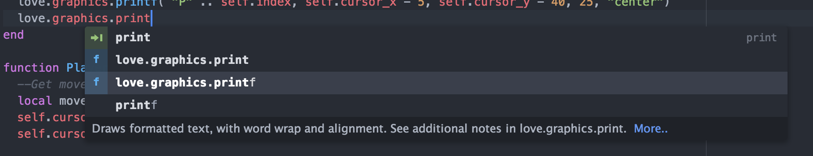

# autocomplete-love

> This repository is now archived due the the [deprecation of Atom](https://github.blog/2022-06-08-sunsetting-atom/).

Auto-complete and snippets for LÖVE. For more LÖVE development tools in Atom, see [love-ide](https://github.com/rameshvarun/love-ide).

